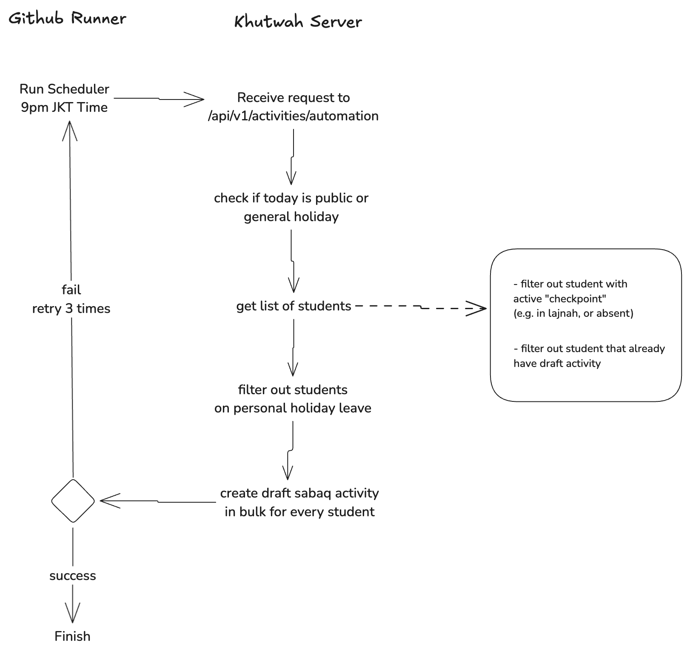

# Draft Sabaq Automation Documentation

## Background

Occasionally, Ustadz may forget or be unable to record a student’s Sabaq activity. This automation assists Ustadz by generating a draft Sabaq, enabling them to complete the report the following day.

## Solution

We utilize a GitHub workflow scheduler to send an HTTP request to the automation API daily at 9 PM Jakarta Time. This triggers the generation of draft Sabaq records.

## Technical Details

### GitHub Workflow

The workflow executes daily at **9 PM Jakarta Time** and sends an HTTP GET request to `/api/v1/activities/automation` without requiring credentials.

### Automation API

The `/api/v1/activities/automation` endpoint is currently bypassed from authentication. This is considered secure as no client-provided payload is expected, and only success or error messages are returned.

The API utilizes the **Supabase service role key** to interact with the database without requiring authentication.

Within the API, the following steps are performed:

1. **Holiday Check**

   - If the current day is a public or general holiday, the process is skipped, and an immediate response is returned.
   - Holiday data is retrieved from:
     - `@/data/holidays/public.json`
     - `@/data/holidays/general.json`
   - For further details, refer to the [Holidays Documentation](../holidays.md).

2. **Retrieve Student List**

   - Filter out students with active checkpoints (e.g., lajnah or absent status) as they do not perform Sabaq in such cases.
   - Exclude students who already have a draft activity, as the Ustadz may have already started but not completed it.
   - Include `shift_id` and `ustadz_id` in the student data, as these are required for creating the activity.

3. **Planned Holiday Check**

   - Exclude students who have planned holidays for the current day.
   - Holiday data is retrieved from `@/data/holidays/student.json`.

4. **Draft Sabaq Activity Creation**
   - Bulk create draft Sabaq activities with the following prefilled data:

| **Column**           | **Value**                                                     | **Notes**                                                                |
| -------------------- | ------------------------------------------------------------- | ------------------------------------------------------------------------ |
| `student_id`         | `student.id`                                                  |                                                                          |
| `shift_id`           | `student.shift_id`                                            |                                                                          |
| `type`               | `ActivityType.Sabaq`                                          |                                                                          |
| `is_target_achieved` | `false`                                                       | Ustadz is expected to update this value.                                 |
| `notes`              | `'Draft Sabaq ini dibuat otomatis, mohon segera dilengkapi.'` | Indicates the activity is auto-generated and requires updates by Ustadz. |
| `tags`               | `[]`                                                          | Ustadz is expected to maintain consistent tagging.                       |
| `status`             | `ActivityStatus.draft`                                        |                                                                          |
| `student_attendance` | `'present'`                                                   | Ustadz can delete the activity if the student was absent.                |
| `target_page_count`  | `GLOBAL_TARGET_PAGE`                                          |                                                                          |
| `page_count`         |                                                               | Ustadz is expected to update this value.                                 |
| `created_by`         | `student.shift_ustadz_id!`                                    |                                                                          |

### Notes on Prefilling Data

- **Surah Details**: These are not prefilled to avoid confusion. Ustadz should manually add them based on the current context.
- **Tags**: Tags are left empty for Ustadz to fill and maintain formatting consistency.

This automation ensures that Ustadz are notified to complete reports promptly, maintaining accuracy and efficiency in Sabaq activity tracking.
